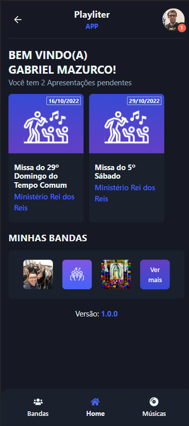

# Playliter PWA (Next)

A band management app developed by [@Mazurco066](https://github.com/Mazurco066).
Production publish URL: [Playliter](https://playliter.com.br).

## Screenshots

| Home screen                          | Band details                            |
| ------------------------------------ | --------------------------------------- |
|       |          |

## Libraries and Structure

This app was developed using

* **[NextJs](https://nextjs.org/)** - Web development Framework
* **[Chackra UI](https://chakra-ui.com/docs/components)** - Clean Visual Framework
* **[Axios](https://axios-http.com/ptbr/docs/intro)** - Http client for REST APIs

## Setup

Assuming you have [yarn](https://yarnpkg.com/), run the following commands to install dependencies and run the App:

```sh
yarn install
yarn dev
```

Obs: Dont forget to copy the content of .env.example file to a new .env file before starting

### License

This project is licensed under the MIT License. Check the [LICENSE](LICENSE) file for further details.